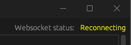
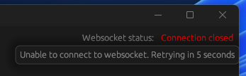
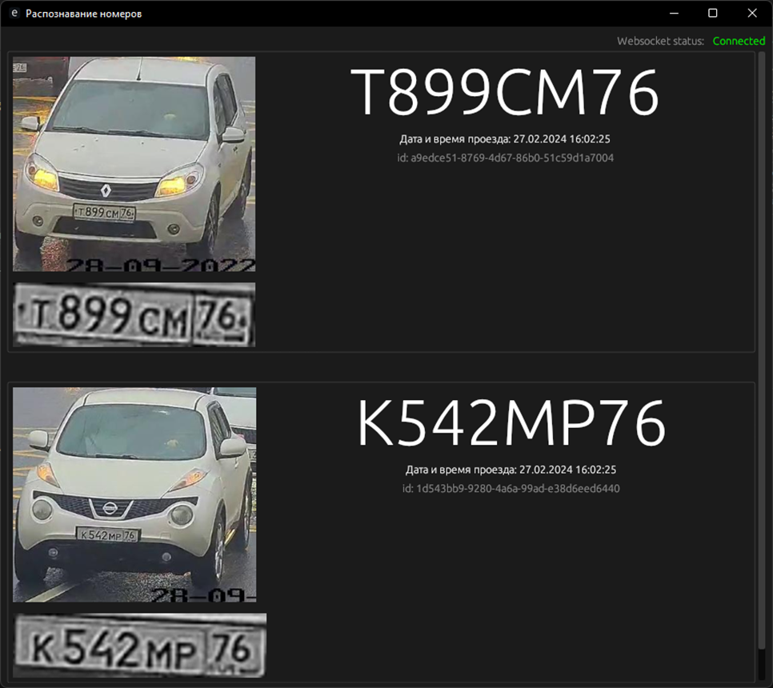
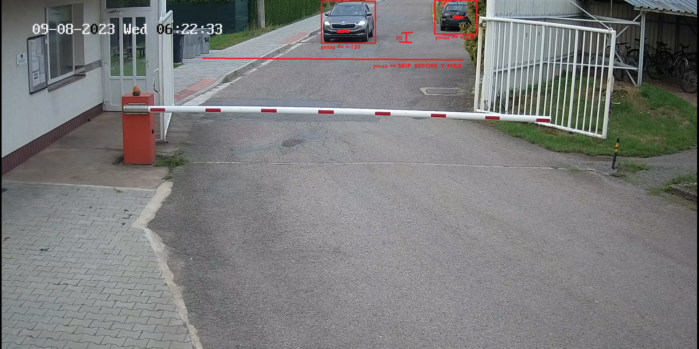
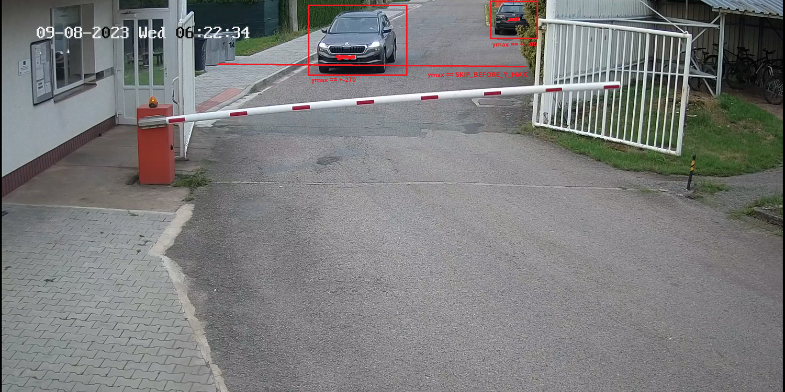

# Main Gate ALPR

- [Как работает ПО?](#как-работает-по)
- [Настройка](#настройка)
  - [Преднастройки](#преднастройки)
  - [Запуск веб-сокета и сервера](#запуск-веб-сокета-и-сервера)
  - [Запустите пример клиента (необязательно)](#запустите-пример-клиента-необязательно)
  - [Обучите свою собственную модель (опционально)](#обучите-свою-собственную-модель-опционально)
  - [Как настроить env](#как-настроить-env)
    - [База (заметно меняет поведение приложения)](#база-заметно-меняет-поведение)
    - [Пользовательские настройки (Может стать проблемой при ошибках в изменениях)](#пользовательские-настройки-возня-с-ними-может-стать-незаметной-проблемой-если-вы-не-знаете-что-делаете)
- [Примечания по разработке](#примечания-по-разработке)
- [Acknowledgements](#acknowledgements)
  - [yolov8](#airesourcesyolov8)
  - [andrewmvd_dataset](#airesourcesandrewmvd_datasetzip)
  - [aslanahmedov_dataset](#airesourcesaslanahmedov_datasetzip)
  - [Другое](#другое)

# Как работает ПО?

Это всего лишь высокоуровневое объяснение, если вы хотите получить более глубокое понимание, прочтите [env config](#как-настроить-env) + исходный код :D

1. Когда вы запускаете веб-сервер, все переменные env и модели искусственного интеллекта загружаются в память.
2. Если вы включили сохранение результатов, будет создан каталог для результатов
3. Два потока работают так,
   - Первый считывает кадры с IP-камеры / видео и обеспечивает постоянное подключение к источнику ввода. Если вы работаете в режиме отладки, вы увидите окно с камеры.
  - Второй получает последний кадр и передает его в pure yolo.
4. После анализа программа сгруппирует все автомобили в массив и проверит, достаточно ли далеко они отъехали.
5. После этого он передает обрезанное изображение в программу точной настройки yolo для номерных знаков.
6. Номерной знак обрезается и предварительно обрабатывается (подробнее внутри `./utils.py`)
7. Затем номерной знак разделяется на каждый символ, который передается в tesseract при использовании всех возможных потоков
8. Значение номерного знака уточняется и подтверждается ([больше о валидации](#как-настроить-env))
9. Номерной знак и обрезанный автомобиль отправляются всем клиентам, подключенным к websocket.
    - и при необходимости сохраняется в каталоге DB/Results, в зависимости от среды .env

# Настройка

## Преднастройки

- python 3.11.2
- docker (необязательно, на случай, если вам нужна база данных для локальной разработки)
- rust (необязательно, если вы хотите опробовать предоставленный пример клиента, однако вы можете подключиться к серверу websocket через любое другое приложение, например Postman)

1. Перейдите в папку `./ai/resources`
2. ```
   cat yolov8m_* > yolov8m.pt
   cat yolov8l_* > yolov8l.pt
   cat yolov8x_* > yolov8x.pt
   cat andrewmvd_dataset_* > andrewmvd_dataset.zip
   cat aslanahmedov_dataset_* > aslanahmedov_dataset.zip
   cat tdiblik_lp_finetuned_yolov8m_* > tdiblik_lp_finetuned_yolov8m.pt
   cat tdiblik_lp_finetuned_yolov8l_* > tdiblik_lp_finetuned_yolov8l.pt
   cat tdiblik_lp_finetuned_yolov8x_* > tdiblik_lp_finetuned_yolov8x.pt
   cp yolov8*.pt ..
   ```
3. Вернитесь в корневую папку
4. `pip install torch torchvision torchaudio --index-url https://download.pytorch.org/whl/cu118`
   - или эквивалент, [based on your system configuration](https://pytorch.org/#,INSTALL%20PYTORCH,-Select%20your%20preferences)
5. Установите [tesseract](https://tesseract-ocr.github.io/tessdoc/Installation.html)
6. `pip install -r requirements.txt`
7. Убедитесь, что вы делаете это с тем же пользователем (unix), с которым будет запускаться программа! В случае, если вы выполняете это под другим пользователем, обязательно выполните шаги 4-6 с `sudo -H -u <usr> pip3 install ...` префикс.

## Запуск веб-сокета и сервера

1. Зайдите в `./server`
2. Скопируйте `.env.development` в `.env`
3. [Настройка env](#как-настроить-env)
4. Настройка сервера базы данных (необязательно, зависит от вашего `.env`)
   1. Убедитесь, что вы соблюдаете лицензионные требования Microsoft, поскольку я выбрал базу данных MSSQL. Я сделал это, потому что она уже интегрирована на моем рабочем месте. Лично я использую docker только для разработки / тестирования.
   2. Вернитесь в корневую папку.
   3. ```
      # (в Windows замените "pwd" на "pwd -W`)
      docker run -e "ACCEPT_EULA=Y" -e "MSSQL_SA_PASSWORD=MyV€ryStr0ngP4ssW0rĐ" \
       -p 1433:1433 --name main_gate_aplr_db --hostname main_gate_aplr_db \
       -v $(pwd)/db/data:/var/opt/mssql/data \
       -v $(pwd)/db/log:/var/opt/mssql/log \
       -v $(pwd)/db/secrets:/var/opt/mssql/secrets \
       -d mcr.microsoft.com/mssql/server:2022-latest
      ```
   4. `docker exec -it main_gate_aplr_db "bash"`
   5. `export QUERY_TO_EXECUTE="{CONTENTS_OF_./db/init.sql}"`
   6. `/opt/mssql-tools/bin/sqlcmd -S localhost -U SA -P "MyV€ryStr0ngP4ssW0rĐ" -Q "$QUERY_TO_EXECUTE"`
5. Автоматизировать процесс запуска (необязательно, рекомендуется)
   - Создайте файл с именем `main-gate-alpr-server.service` внутри `/etc/systemd/system`
   - Скопируйте содержимое файла `./server/main-gate-alpr-server.example.service` в `main-gate-alpr-server.service` и обязательно заполните поле `<<usr>>` в процессе.
   - `sudo systemctl daemon-reload`
   - `sudo systemctl enable main-gate-alpr-server.service`
   - `sudo systemctl restart main-gate-alpr-server.service`
   - `sudo systemctl status main-gate-alpr-server.service` (необязательно, убедитесь, что процесс запущен)
   - `sudo journalctl -u main-gate-alpr-server.service` (необязательно, смотрите лог)
6. `python server.py`

## Запустите пример клиента (необязательно)

1. Перейдите в `./client`
2. Убедитесь, что переменная `WEBSOCKET_URL` правильно настроена внутри `./client/src/main.rs` на основе `.env` вашего сервера.
3. Запустите `cargo r`
4. Вы должны увидеть одно из следующих состояний
   - Client can be trying to connect
     - 
   - Client can be disconnected (hover over for more info)
     - 
   - Or working as intended! (if you setup everything correctlly)
     - 

## Обучите свою собственную модель (опционально)

1. Перейдите в `./ai` папку
2. `export PYTORCH_CUDA_ALLOC_CONF=max_split_size_mb:512` (on Linux) or `set PYTORCH_CUDA_ALLOC_CONF=max_split_size_mb:512` (в Windows)
3. `python prepare.py`
4. Перейдите в `train.py` и настройте, какую предварительно обученную модель вы хотите использовать.
5. `python train.py`
   - Если вы столкнулись с ошибкой с путем, повторный запуск программы, вероятно, решит ее. По какой-то причине (связанной с ultralytics \_(ツ)\_/) иногда происходит сбой при первом запуске в новом каталоге. Если ошибка не устранена, откройте новую проблему.
   - Если у вас закончится память графического процессора или вы столкнетесь с какой-либо ошибкой во время тренировки, поиграйте с переменной `batch`. На моем RTX 3070 Ti достаточно 16 партий для небольших моделей (n/s/m), однако для более крупных моделей (l/x) я уменьшил количество партий до 8

## Как настроить env

Вы можете найти пример конфигурации по адресу `./server/.env.development`

### База (заметно меняет поведение)

- DEBUG
  - Если вы хотите просмотреть отладочную информацию, установите значение "True".
  - Это не только отобразит журналы, откроет окно, в котором вы сможете просмотреть видеопоток, но и сохранит промежуточные файлы при сопоставлении, чтобы вы могли их просмотреть, в `./server/intermediate_detection_files`
  - Если вы хотите отключить это, просто удалите опцию или установите для нее любое другое значение, кроме `True`
- WS_PORT
  - **required**
  - Определяет порт сервера веб-сокетов.
- RTSP_CAPTURE_CONFIG
  - **required**
  - Видеовход для сопоставления.
  - Это может быть либо пользовательское видео, в этом случае укажите путь к файлу (eg. `"./test.mp4"`), или RTSP path (eq. `"rtsp://{username}:{password}@{ip}:{port_probably_554}/Streaming/channels/1/"`). Вероятно, вы можете найти информацию о конфигурации RTSP по следующему пути к вашей IP-камере (`http://{ip}:{port_probably_80}/Streaming/channels/1/`). Если вы не можете найти конфигурацию, попробуйте изменить часть URL-адреса, связанную с каналами (например, `1/2/3,...`).
  - Если вы не уверены, правильно ли вы настроили эту переменную, перейдите в `./server` и запустите `python test_rtsp.py`. Он будет использовать ваш ".env", как это сделал бы веб-сервер, и предоставит вам визуальную обратную связь.
- PURE_YOLO_MODEL_PATH
  - **required**
  - Для распознавания автомобилей используется чистая неотредактированная модель yolo(v8).
  - Пока это yolov8, не имеет значения, какой тип (n/s/m/l/x) вы выбираете. Чтобы сэкономить ваше время, вы можете найти модели по адресу `./ai/resources/yolov8*.pt`.
  - Примерное значение может выглядеть как `"../ai/resources/yolov8n.pt"`
- LICENSE_PLATE_YOLO_MODEL_PATH
  - **required**
  - Точно настроенный путь к модели, используемый для сопоставления номерных знаков.
  - Я уже настроил все версии Yolo, так что вам не нужно этого делать. Вы можете найти его в разделе `tdiblik_lp_finetuned_yolov8*.pt` (где `*` представляет тип модели)
- DB_ENABLED
  - Если вы хотите вставить результаты в базу данных, установите для этого значения значение "True".
  - Если вы установили для этого значения значение "True", обязательно следуйте руководству по настройке базы данных.
  - Вы можете найти схему базы данных по адресу `./db/init.sql`. Для работы сервера веб-сокетов требуются только поля `id`, `license_plate` и `captured_at`, однако, поскольку этот сервер используется как часть проприетарного решения, я просто включил всю схему, как есть в проприетарном решении:D. Не стесняйтесь редактировать его в соответствии с вашим вариантом использования.
  - если вы хотите отключить это, просто удалите опцию или установите для нее любое другое значение, кроме `True`
  - Если вы включаете DB, все следующие параметры env рассматриваются как **required**
  - DB_SERVER
    - Sql server IP / DNS alias (eg. `localhost`)
  - DB_PORT
    - Вероятно, вы захотите установить значение `1433`, поскольку это порт MSSQL по умолчанию.
  - DB_NAME
    - Имя базы данных, используемой на вашем сервере баз данных
    - Если вы использовали `./db/init.sql`, вы хотите установить это значение равным `lpdb`
  - DB_USER
    - Пользователь базы данных для использования
    - Если вы использовали команду настройки docker или не меняли значения по умолчанию (не рекомендуется), вы хотите установить это значение равным `SA`
  - DB_PASSWORD
    - Пароль пользователя базы данных
- Если вы использовали команду настройки docker, вы хотите установить это значение равным `MyV€ryStr0ngP4ssW0rĐ`
- SAVE_RESULTS_ENABLED
  - Если вы хотите сохранить совпадающие изображения автомобиля и номерного знака, установите для этого значения значение "True".
  - Если вы хотите отключить это, просто удалите опцию или установите для нее любое другое значение, отличное от "True"
  - Если вы включаете сохранение результатов, все следующие параметры env рассматриваются как **required**
  - RESULTS_PATH
    - Путь для сохранения результатов (будет создан, если не существует)
    - Например. `"./results"`
- SHOULD_SEND_SAME_RESULTS
  - Как только номерной знак сопоставлен, проверяется, следует ли отправлять результат. В принципе, если программа уже отправила значение номерного знака, такое же, как и то, которое сопоставляется в данный момент, за последние 5 минут, сопоставленный номерной знак будет проигнорирован.
  - Если вы хотите включить это поведение (по умолчанию), просто удалите опцию или установите для нее любое другое значение, кроме "True"
  - Если вы хотите отключить это поведение и обрабатывать все совпадения, установите для этого значения значение `True`.

### Пользовательские настройки (возня с ними может стать незаметной проблемой, если вы не знаете, что делаете)

- SHOULD_TRY_LP_CROP
  - У некоторых моделей могут возникнуть проблемы с распознаванием детали рядом с номерным знаком как части номерного знака (см. рисунок ниже)
  - Если вы столкнулись с подобным поведением ваших моделей, установите для этого значения значение "True", и программа попытается программно вырезать эту часть.
  - В противном случае просто удалите опцию или установите для нее любое другое значение, кроме `False`
- MINIMUM_NUMBER_OF_CHARS_FOR_MATCH
  - Вы, вероятно, хотите установить это значение по умолчанию "8"
  - В принципе, если вы сопоставляете номерной знак, однако вам не удается найти больше, чем MINIMUM_NUMBER_OF_CHARS_FOR_MATCH контуров (предварительно обработанные, обрезанные, одиночные символы номерного знака), нет причин пытаться прочитать его (и тратить время процессора / циклы), поскольку номерные знаки не будут действительными в любом случае. Итак, разумное решение - просто пропустить это.
  - Если вы не поняли предыдущее предложение, но все равно хотите с ним поработать, просто установите минимальное количество символов, которое должен содержать номерной знак, чтобы он совпадал.
- NUMBER_OF_VALIDATION_ROUNDS
  - Вероятно, вы захотите установить это значение по умолчанию "3"
  - Таким образом, качество камеры может быть плохим, а искусственный интеллект не работает корректно в 100% случаев. Вот почему существует переменная NUMBER_OF_VALIDATION_ROUNDS. По сути, весь вывод процесса сопоставления сохраняется в промежуточном массиве, который фильтруется (на фильтрацию влияет NUMBER_OF_OCCURRENCES_TO_BE_VALID) при каждом N-м запуске, и после этого результаты отправляются/сохраняются/и т.д. Если вы хотите увидеть, как работает фильтрация, ознакомьтесь с `./server/server.py`, функция `validate_results_between_rounds`
  - Кроме того, если вы установите NUMBER_OF_OCCURRENCES_TO_BE_VALID > NUMBER_OF_VALIDATION_ROUNDS, то у вас никогда не совпадут ни одни номерные знаки :D
- NUMBER_OF_OCCURRENCES_TO_BE_VALID
  - Вероятно, вы хотите установить для этого значения значение по умолчанию "2", или, если вы возились с NUMBER_OF_VALIDATION_ROUNDS, вы, вероятно, хотите, чтобы это было `NUMBER_OF_VALIDATION_ROUNDS - 1`
  - Внутри промежуточного массива указано, сколько раз должен встречаться номерной знак, чтобы он считался действительным и прошел проверку. Если вы хотите увидеть, как работает фильтрация, ознакомьтесь с `./server/server.py`, функция `validate_results_between_rounds`
- SKIP_BEFORE_Y_MAX
  - Это сложный вопрос, однако, вероятно, самый важный во время работы. Хорошо, когда мы находим автомобиль на картинке, мы можем предположить, что если он находится слишком далеко от верхней части картинки, номерной знак не читается, следовательно, мы можем игнорировать этот автомобиль и не тратить впустую процессорное время / циклы.
  - "ymax" - это нижняя строка совпадающего автомобиля.
  - Давайте посмотрим это на практике, на следующем рисунке ни одна из машин не совпадет, потому что мы можем предположить, что автомобиль находится достаточно далеко, чтобы номерной знак был грязным и не читаемым.
    
    на этом снимке обе машины находятся далеко, и мы можем предположить, что чтение номерного знака будет пустой тратой времени.
  - Однако на следующем снимке одна из машин находится достаточно близко, чтобы можно было прочитать номерной знак, и поэтому она не игнорируется.
    
  - Такая оптимизация позволяет нам запускать только обнаружение автомобиля и при необходимости пропускать этап распознавания номерных знаков. Это значительно ускоряет работу программы и даже обеспечивает лучшие результаты, поскольку мы игнорируем "мусорные" данные.

# Примечания по разработке

- При добавлении материала в ресурсы, для чего-либо размером более 25 МБ, используйте следующую команду: `split -b 25M --numeric-suffixes <name> <имя>_` и добавьте соответствующую документацию о том, как собрать его обратно после клонирования.
- Если вы видите псевдоним `lp` внутри кода, это сокращенная форма "номерного знака".
- На данный момент самой большой проблемой является сам механизм распознавания текста, потому что иногда он ведет себя некорректно. Я рассматривал возможность использования PaddleOCR, однако мне не удалось заставить его работать. Тем не менее, он работает достаточно хорошо в производстве (отсутствует только 1 из 20 автомобилей).

# Acknowledgements

## ./ai/resources/yolov8\*

Модели Yolo были загружены из [репозитория ultralytics](https://github.com/ultralytics/ultralytics). Мне не удалось найти никакой документации о том, как их использовать, пожалуйста, если вы это сделаете, отправьте запрос на извлечение.

## ./ai/resources/andrewmvd_dataset.zip

```
BibTeX
@misc{make ml},
title={Car License Plates Dataset},
url={https://makeml.app/datasets/cars-license-plates},
journal={Make ML}
```

Я скачал следующее [kaggle dataset](https://www.kaggle.com/datasets/andrewmvd/car-plate-detection).

## ./ai/resources/aslanahmedov_dataset.zip

Я скачал следующее [kaggle dataset](https://www.kaggle.com/datasets/aslanahmedov/number-plate-detection). Первоначальным автором является [ASLAN AHMEDOV](https://www.kaggle.com/aslanahmedov), однако цитируемые источники являются "веб-скрапингом".

## Другое

- Во время обучения следующая статья freeCodeCamp была действительно полезной для начала: [How to Detect Objects in Images Using the YOLOv8 Neural Network](https://www.freecodecamp.org/news/how-to-detect-objects-in-images-using-yolov8/) - [Andrey Germanov](https://www.freecodecamp.org/news/author/germanov_dev/)
